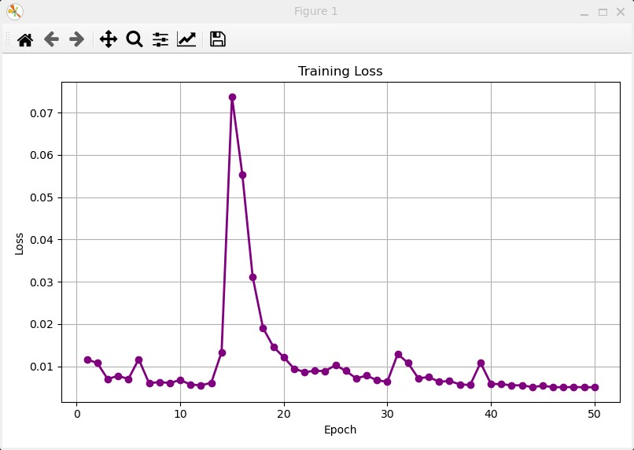

# EGNN-and-MLP-for-3body-prediction
EGNN and MLP for 3body prediction via JAX+Haiku
#### 这个project的目的是用deep learning来预测三体运动轨迹。基于前人开发的经典力学体系下传统计算物理方法（RK4）求解三体（太阳、地球、木星）运动轨迹的程序，从中提取出数据集。将数据集用于神经网络训练，最后用训练出的参数以及一组随机的初值连续多次迭代，产生一条完整轨迹，追求这条轨迹的准确性就是本次的目的。
config中存储了一些参量，utils存储了一些工具函数，others中是仅在测试时使用的一些函数（现已无用），model中定义两个模型（MLP、EGNN）的函数，train是训练函数，evaluate是评估函数（两种），在main中进行调用。写到后面结构已经有些混乱，比如因为MLP和EGNN使用同一个训练/评估函数但是输入参数不同的缘故，导致MLP的参数在main.py中修改，而EGNN的参数在train/evaluate函数中修改。

data中的ml3b_X/Y是原始数据，X/Y_new是扩充后的正在使用的数据。

### 过程

数据集采集阶段，采集了［N，11］大小的数据，11个特征分别为［m_a、m_b、m_c、x_b、y_b，vx_b、vy_b、x_c、y_c、vx_c、vy_c］，a为中心恒星，固定不动处理，b、c为行星。数据采集方法为生成11个随机的初值，将演化轨迹中的相关量的演化输出。质量为随机生成，不过为了保证“a固定不动”的物理意义不失真，a的质量通常在b、c的100倍以上。并且为了在各个数量级上质量的分布概率相等，对相关的生成函数的概率采用了指数下降的设计（否则若质量随机范围在（1，1000），那么生成的大部分质量都是三位数，不具备普适性）。但是三体轨道往往很“敏感”，随机生成的轨道往往大部分逃逸，于是写了一个判断条件，根据结果将轨道分成三类并控制相应比例以采集到覆盖面广且不极端的数据：稳定轨道50%、高能轨道30%、逃逸轨道20%。共采集100条，每条采集100个数据点。原程序时间步为0.01y，每隔十次采集一次，即数据集时间步为0.1y，设计的本意是减少步长累积带来的误差。

最后共得到9900条样本。为了扩充样本以及让模型学会对称性，通过旋转操作以及镜面对称操作让样本量最终来到15w左右。

模型采用MLP和EGNN，采用MLP是因为该任务输入特征少，看起来不太复杂，用轻量MLP训练很合适。采用EGNN是因为物理背景的天然适配，但一共只有三个节点，可能效果会不太理想。其他模型个人认为不太合适。好像整体的框架不止一种写法，可以写成面向对象式的，也可以写成纯函数式的，如果整体架构比较复杂还是采用面向对象式的比较好。但我意识到不止一种框架的时候函数式的写法已经写了差不多了，索性就这样了。犹豫过是否要将质量作为输出标签，但最终为了输入输出一致的美观性决定输出质量，这可能是一个错误。

数据预处理采用了（0，1）的高斯分布归一化，如果不这么操作恒星质量特征的数量级太大，导致训练结果的loss极大无比并且十分不稳定。

损失函数采用MSE，觉得会比较适合，优化器采用adam。利用速度和位移可以引入能量守恒和角动量守恒加入损失函数作为惩罚项强迫模型学习物理规律，不过由于数据输入是归一化的，因此得先反变换回原始数据计算这一项，这可能会带来精度的缺失（但好像测试出来并没有），但这么尝试后发现这一项的loss非常爆炸导致输出变成了nan。目前还在排查原因，不知是单纯数量级不匹配还是另有原因（如不稳定的除零操作带来的爆炸），于是暂时先把这一项loss屏蔽了。

正则化方法采用了dropout来防止过拟合，思考过要不要再引入L2，但目前没有这么做。

对于MLP模型。隐藏神经元数量、网络深度、batch_size、学习率等超参数经过一些有限的调试后最终选择了config.py中的形式，学习率采用了线性下降。这一部分最大的感触就是“绝知此事要躬行”，上手后会发现用自己设计的数据集、神经网络测试出的结果不会像书中那么“标准”。如同实验一般会出现各种问题。调试中遇到了各种问题，书中教的是“太陡峭就调小学习率，loss走不动路就增大学习率”。但有时学习率太小虽然比较稳定但是收敛到的值并不低（可能卡在了局部最小值出不来），学习率太大loss比较低但是不稳定，而折中的值很难把握，并且不仅仅只有学习率这一个超参数，参数之间可能是耦合而非独立的关系，神经元数量太多、太深容易过拟合，某次把神经网络调的太深，又把宽度拉的很大，最后的结果很难看，可能是梯度消失了，但加上了残差连接之后似乎效果也没改善，遂放弃。有时损失函数会出现缓慢上升，似乎也可能是网络太深带来的梯度消失带来的。

对于EGNN模型，这个模型改写自教授的ML4P第四章的EGNN模型，只是将面向对象式改成了函数式，添加了dropout，并添加了Trans/Inverse_Trans函数改写了输入输出的格式。相比MLP，对这个模型的了解更少，对于一些参数的改动会产生什么后果更加不了解。就测试结果来说，这个模型对于学习率极为敏感，模型处于“走不动路”和“nan”两个极端之间，某次微妙的学习率带来的微妙的结果验证了这一点 ，在几乎走不动的loss中突然出现了一个epoch使得loss飙升70倍，然后迅速下降。我将学习率调整为1e-2，此时loss走不动路，而调整为1.5e-2后，便会出现nan。目前还在寻找原因，猜测可能是位置坐标的更新机制，每次叠加上从其他坐标收集来的信息，一直叠加导致这一项飞速升高，于是尝试引入了参数alpha，削弱叠加项的权重，但结果并不见好转，遂放弃这一假设。

此外关于此模型我还有一个问题：ML4P中的EGNN.py中的mlp部分，隐藏神经元的维度几乎都取为F，F是h的特征维度，为什么要这么取？有一项phie函数中需要特征维度的对齐来进行残差连接，这我可以理解，但其他隐藏层也是这么选取我不太明白，最终我自己引入了一个隐藏层维度作为另一个超参数输入，不然h只有三维，我担心MLP的效果不会好。

对于验证，我采用了五折交叉验证的方式，MLP的验证结果比较传统，验证集的损失函数大致比训练集的高一些，而EGNN的结果比较奇怪，验证集的结果时高时低，不太稳定。

最后，采用了一个“连续评估”模式，从数据集中随机抽取一个样本输入作为输入，对其采用评估模式，并将输出作为输入迭代一千次，模拟出演化轨迹，导出后进入animation.py得到效果。目前的效果并不理想，可以说比较失败，EGNN得到的结果似乎难以捕捉到引力作用，星体整体直线运动并且速度比较奇特。MLP的结果更加怪异，经过一个极短的时间后星体就都静止不动，速度降为0。

对于MLP的结果，猜测可能是模型陷入了一个“恒等”的循环。当速度变小之后，如果输出结果接近输入结果，那么损失函数会很小，导致输出结果不断偏向输入结果，导致速度更小，最后模型变成恒等输出器。这应该是一个模型结构上的缺陷，这导致这个模型其实一直在学习恒等映射而不是物理的动力学规律，思考了一下解决方法。

1. 如果对数据集进行预处理，将模型从“预测下一个状态”改为“预测变化量”，可能结果会好一些。这样模型就不会变成一个恒等输出器，然后使用时再进行残差连接，感觉这个方案可行性比较强，是接下来决定尝试的改进方向。

2. 这个模型本质上还是太“蒙蔽”了，虽然我考虑到步长累计带来了模型误差的飞速提升而加大了步长，但这应该没法从原则上解决问题。如果去模仿语言模型的设计，把它设计成一个自回归模型，一个sequence对应一条轨迹，一个token对应一个时间点的状态，token不同的feature对应于该时间点的各个物理量。这样这个模型就会更好捕捉到上下文关系，不会有那么大误差。不过如果不采用1中所提及的求差的话可能仍然会“停滞”。

3. 上文提到的“将能量守恒与角动量守恒”引入损失函数，这样的话这种“停滞”应该就会被判断为不合理的，但是由于每一个时间步之间的间隔都很短，可能模型也很难捕捉到这种能量守恒与角动量守恒关系。但是如果我们把以上三点结合，整体改成一种自回归transformer，引入时间作为位置编码，并依然采用残差（让transformer预测下一个位置的变化量），在此基础上引入守恒律作为损失函数的一部分。可能这样会有一个比较好的效果。

综上，我个人的预见是3的效果最好，1其次，2可能单独来讲没什么用。不过3需要改动整个结构，颠覆了这个项目本身，我想先试试1，然后开一个新的project来尝试一下3，不过可能有人已经尝试了这个做法，我打算先找找有没有相关文献做过这个。不过也有可能我的设想不太正确，方向有问题，请指正。

以上是对于MLP模型的修改直觉，对于EGNN模型，我目前还没什么头绪，打算再调试一下看看。

## 总结&其他
这个项目目前调试出的结果还不是很好，在此仅作阶段性汇报，可能是参数有问题，更可能是结构有问题，接下来打算微调一下结构，或者说干脆采用一种新模型。我个人倾向于先在这个模型基础上调整，继续测试一下，可能会有一些更深刻的发现和经验体会。

/

在写代码过程中也碰到一些技术问题，印象比较深刻的是让gpt给我写了一个保存/读取params的函数，当时还在写MLP的架构，执行起来没什么问题，后来写了EGNN的架构，训练时也没出现问题，评估时model.py却一直报错

“has occurred: ValueError

Unable to retrieve parameter 'w' for module 'edge_mlp_0/~/linear_0' All parameters must be created as part of init.”

debug了一两个小时也没找到问题，后来换了Gemini问了一下发现竟然是保存/读取params的函数有问题。

“aiku 的网络参数 (params) 严格来说是一个两层嵌套字典，结构为 Dict[module_name, Dict[param_name, array]]。
问题出在你的 utils.py 中的参数保存和加载逻辑。Haiku 会在模块名称中大量使用斜杠（例如报错中的 "edge_mlp_0/~/linear_0"），而你原本的 load_params_npz 函数是这样写的：”

我大概很难想到bug竟然出现在utils模块的一个保存导入函数，感觉这一点得靠经验的积累，或者去透彻理解一些底层函数，遇到问题时一个AI解决不了也可以去尝试询问一下另一个AI，人多力量大。